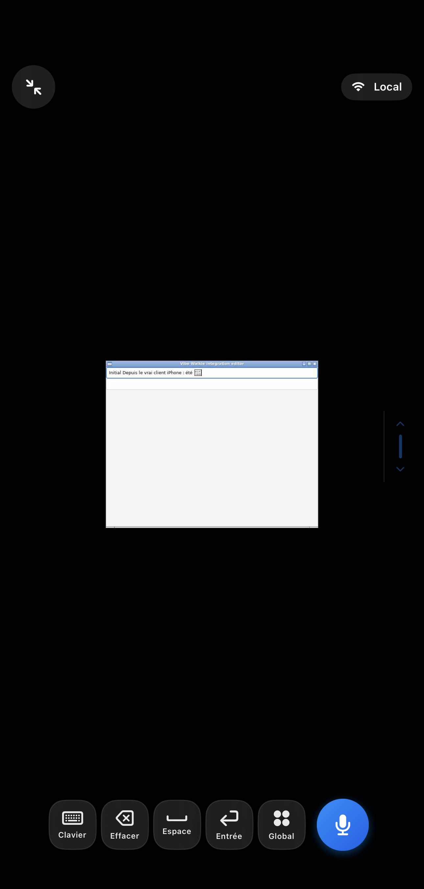

# Compagnons Windows et Linux dans l’app actuelle

Validation du 11 septembre 2026. Cette livraison utilise l’interface iPhone actuelle, avec ses achats, son suivi de marche et ses commandes existantes. Le dépôt est aligné sur le dossier de publication actif de l’application `app.vibewalkie` ; les interfaces Duo restent dans une branche séparée.

## Livraison

- Application iPhone 1.0.0, build **202609111055**, signée pour `app.vibewalkie` et l’extension `app.vibewalkie.controls`.
- Apple a traité ce build avec le statut **VALID**. L’API App Store Connect confirme son association au groupe TestFlight interne **Équipe Vibe Walkie**. Aucun lien public TestFlight n’existe pour ce groupe.
- La soumission App Store préexistante reste en attente de revue ; elle n’a pas été remplacée.
- [Compagnons 1.0.0](https://github.com/ncleton/vibe-walkie/releases/tag/companions-v1.0.0), construits depuis le commit `bf798c6`, avec archive source, scripts d’installation et `SHA256SUMS.txt`. Le tag est signé avec la clé SSH de publication. Le téléchargement public a été comparé octet par octet avec l’archive locale.

## Vérifications effectuées

| Périmètre | Résultat |
| --- | --- |
| RemoteCore | 81 tests réussis |
| iOS actuel | 62 tests réussis |
| macOS actuel | 110 tests réussis, avec signature ad hoc pour les autorisations caméra |
| Linux Ubuntu 24.04 | 19 tests réussis sur de vrais X11/AT-SPI/GTK |
| Windows Server 2025 | 18 tests CI réussis sur de vrais éditeurs WinForms et WPF, via l’installateur livré |
| Client iPhone natif vers Linux | 1 test d’intégration réussi : découverte Bonjour, TLS épinglé, appairage approuvé, insertion Unicode exacte et affichage JPEG du bureau |
| Interface iPhone | Écran « Installer un compagnon » ouvert dans le simulateur ; instructions Windows et Linux/VPS sélectionnées et vérifiées |
| Qualité | SwiftLint strict sans violation, gitleaks sans secret, invariants de confidentialité vérifiés |
| Fluidité existante | Porte de validation du curseur réussie avant l’archive signée |
| Nettoyage des tests | Deux bundles temporaires indépendants : seul celui appartenant aux produits du test est supprimé |

Le test natif utilise le vrai `MacConnectionClient` de l’application actuelle, dans un simulateur iPhone iOS 26.3. Il ne constitue pas un essai sur iPhone physique. La capture ci-dessous provient de son résultat XCTest. Le conteneur Linux n’a pas de glyphe emoji pour un caractère de la chaîne de test ; l’intégrité Unicode est vérifiée indépendamment de cette police.

Les configurations de commandes et les positions de la palette Global sont isolées par empreinte de compagnon. Les tests couvrent aussi la migration des réglages et le refus explicite de données corrompues.

## Conditions d’utilisation

- Windows : Python 3.11 ou ultérieur et session interactive déverrouillée. Le paquet livré est le compagnon Python avec installateur PowerShell, pas un MSIX.
- Linux : session X11 et AT-SPI. Le lanceur VPS fournit un bureau virtuel Xvfb/Openbox. Wayland est refusé explicitement.
- La dictée vérifiée Linux nécessite un champ AT-SPI EditableText. Dans un terminal, utiliser le clavier manuel.
- Le réseau utilise une adresse privée LAN ou Tailscale installé séparément. Aucun relais Vibe Walkie n’est nécessaire.
- Chaque nouvel iPhone nécessite un QR à secret unique et une approbation locale avec comparaison du code à six chiffres.

Voir le [guide d’installation](../../../Companion/README.md).
